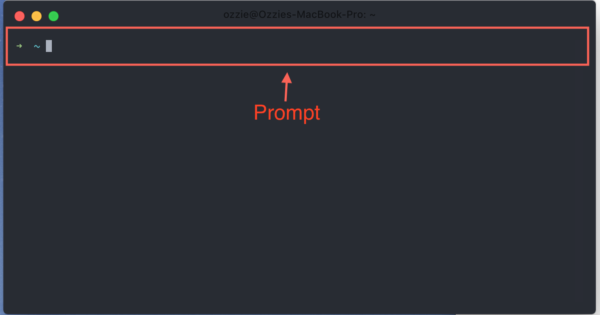

# Background Information

This document covers some common background knowledge that is good to have going into the course.

## Generic

- `foo`, `bar`, and `baz` are used as generic placeholders in tutorials. What they refer to depends on the context
  - e.g. If I told you that you can add the flag `--version` to most commands and then gave you the example of `$ foo --version` you would substitute out `foo` for your actual command
- `parent` and `child` (or `children`) are used to represent heirarchy
  - e.g. If you have a folder `music` with the files `a.mp3` and `b.mp3`, `music` is the parent and `a.mp3` and `b.mp3` are the children
  - e.g. In the context of html: `

Hello!

`, `
` is a child of `
`
- When refrencing a filesystem:
  - Windows uses backslashes, OS X and Linux use forward slashes
    - Windows: `C:\Users\ozzie`
    - OS X + Linux: `/Users/ozzie`
  - A single period `.` refers to the current directory
    - Therefore `./foo.txt` would refer to the file `foo.txt` inside our current directory
  - Two periods `..` refer to the parent directory
    - Therefore `../foo.txt` would refer to the file `foo.txt` one folder above the current folder
    - These can be chained, e.g. `../../../foo.txt` would refer to `foo.txt` 3 directories up
  - A tilde `~` refers to the users home directory and most terminals and programs will expand this appropriately.
    - `~/Code/foo.txt` on a mac would refer to `/Users/ozzie/Code/foo.txt`
    - `~/Code/foo.txt` on linux would refer to `/home/ozzie/Code/foo.txt`
    - `~\Code\foo.txt` on linux would refer to `C:\Users\ozzie\Code\foo.txt`
- If you see a line start with a dollar sign (`$`) in something like a tutorial, it is usually referring to a command to run in a terminal
  - e.g. `$ git status` is telling you to enter `git status` in your terminal
- If you encounter errors at any point in time, you can usually copy and paste the relevant error message into google and find solutions from other people who have ran into the problem before
  - Try to only copy the relevant information, e.g. a specific error code
  - Omit any directories in the error message that refer to your specific filesystem (e.g. error messages that contain `/Users/ozzie/index.js` i would remove that path from the search), as they wont turn results since no one else has that same structure
- When performing google searches, fewer words will net you better results so focus on the keywords

## Command Line Interfaces

You can think of the Command Line Interface (CLI) as a way to delivier specific instructions directly to your computer using `commands` via a `terminal`.

A `terminal` is a program that allows you to interact with the CLI. Windows (`cmd`, `powershell`), OS X (`terminal.app`), and Linux (`terminal`) all come with a default one installed. However, there are many different 3rd party options available:

- [Hyper.app](https://hyper.is) - Windows, OS X, Linux
- [iTerm](https://www.iterm2.com/) - OS X
- [Cmder](https://cmder.net/) - Windows

If you are on Windows 10 I highly suggest using [Windows Subsystem for Linux](https://docs.microsoft.com/en-us/windows/wsl/install-win10) (WSL). This allows you to, at a high level, run a Linux distro inside of your Windows installation which gives you access to a Linux terminal.

## Anatomy of the CLI

The CLI is broken out into a few parts

### The prompt

The prompt is where you enter your command. It's always the last line in the terminal interface. Most prompts will also tell you the current directory you are in. In this case, we're in my home folder (commonly referred to by the tilde `~`). Right next to the folder you can see the gray square, this is our cursor (where we are (positionally) currently typing).

### Commands, Arguments, Flags

A command is simply a file on your computer that contains code to execute when called.

The command is always the first word entered into the prompt.

Arguments are other space-separated instructions we can pass to the preceding command. Arguments are commonly refered to as sub-commands as each command usually has many features that are usable via arguments.

Flags are like arguments in that they come after a command or argument except they start with either a single or double dash (depending on the program) and usually indicate configuration options

> **You should know:** if you're reading a readme or documentation and you see a line starting with a dollar sign and then a space (`$`) it usually indicates that this is a command to enter into your terminal.

`$ git status`

Here `git` is the command and `status` is the argument (or subcommand).

`$ git --help`

Here we ran the command `git` and passed the `--help` flag, which in this case shows us all of the available sub commands we can run with `git`

## CLI Tips

Each command is different in what it does and how it operates.

Here are some common features commands have (may not apply to the specific command you are running)

- CLI's operate in the context of folders. Make sure you are in the right folder before running your command
- Related to the above, paths are assumed to be relative when the leading slash is omitted or it begins with a period
  - `/Users/ozzie/Code` <- Absolute (leading slash)
  - `ozzie/Code` <- Relative (no leading slash)
  - `./ozzie/Code` <- Relative (`./`)
- `~` refers to your home folder (e.g. `/Users/ozzie`)
- `.` refers to the current directory
- `..` refers to the parent directory
- Adding `--help` to the end of your command will sometimes show you how to use it
- Running `$ somecommand --version` will likely tell you the version, useful if what you are doing isn't working to verify you are on the right version
