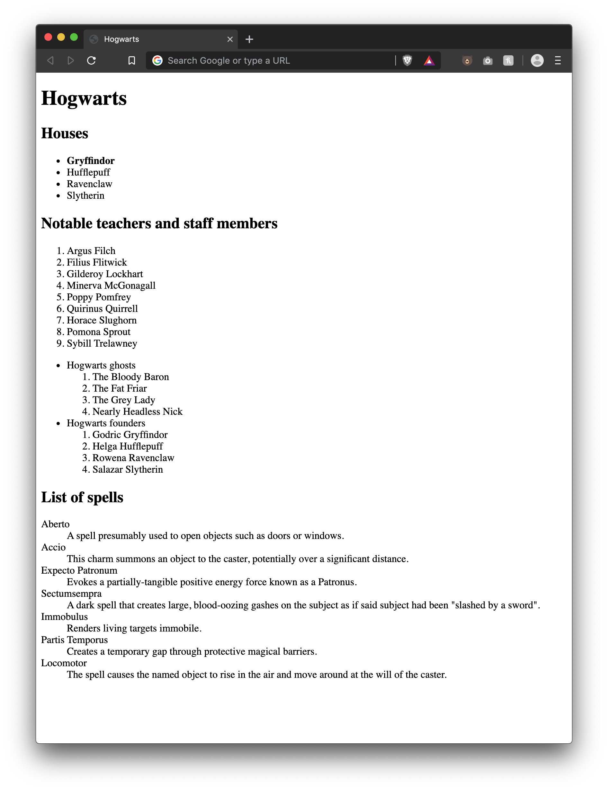

# Exercise 03 - HTML Lists

Lists are all over the web. Dropdowns, top 10's, viewing your favourite spotify songs, lists are everywhere.

As we learned in the last exercise, many elements (like `<em>`, `<strong>`, etc) have default styling/formatting attached to them. Lists get styling to, wzell, look like a list.

There are 3 types of lists in HTML, all by default have a `block` layout:

## Unordered List

The `<ul>` element represents an unordered list of items. We'll use this type of list when we don't care about the items order. By default it will be rendered as a bulleted list.

The child elements of a `<ul>` must be `<li>` (list items). Each `<li>` will be rendered as a bullet (by default).

```html
<h1>Ingredients:</h1>
<ul>
  <li>Eggs</li>
  <li>Milk</li>
  <li>Flour</li>
</ul>
```

## Ordered List

The `<ol>` element represents an ordered list of items. We'll use this type of list when we care about the items order. By default it will be rendered as a numbered list.

This type of list also accepts `<li>` elements as children.

```html
<h1>Top 3 Populated Countries:</h1>
<ul>
  <li>China - 1,389,618,778</li>
  <li>India - 1,311,559,204</li>
  <li>United States - 331,883,986</li>
</ul>
```

## Description or Definition List

The `<dl>` element represents a description list. Common uses for this element are to implement a glossary or to display metadata (a list of key-value pairs).

The element encloses a list of groups of terms (`<dt>` element) and descriptions (`<dd>` elements)

```html
<dl>
  <dt>Firefox</dt>
  <dd>
    A free, open source, cross-platform, graphical web browser developed by the
    Mozilla Corporation and hundreds of volunteers.
  </dd>
</dl>
```

## Nesting Lists

HTML allows infinite nesting of lists, mixing and matching as needed. This can be very helful and used to create things like site navigation menus.

```html
<ul>
  <li>Unorder list item</li>
  <li>
    <ol>
      <li>Order list item</li>
      <li>Order list item</li>
      <li>Order list item</li>
    </ol>
  </li>
</ul>
```

# Exercise Instructions

Create an `index.html` file with the following elements:

- Add a document title: Hogwarts
- Add a main title (`<h1>`): Hogwarts
- Add a subtitle (`<h2>`): Houses
- Add an unordered list with the following items:

```
Gryffindor
Hufflepuff
Ravenclaw
Slytherin
```

- Gryffindor must be strong (use tags not CSS)
- Add a subtitle: Notable teachers and staff members
- Add an ordered list with the following items:

```
Argus Filch
Filius Flitwick
Gilderoy Lockhart
Minerva McGonagall
Poppy Pomfrey
Quirinus Quirrell
Horace Slughorn
Pomona Sprout
Sybill Trelawney
```

- Add the following nested lists, below the first two:

```
* Hogwarts ghosts
  1. The Bloody Baron
  2. The Fat Friar
  3. The Grey Lady
  4. Nearly Headless Nick

* Hogwarts founders
  1. Godric Gryffindor
  2. Helga Hufflepuff
  3. Rowena Ravenclaw
  4. Salazar Slytherin
```

- Add a subtitle: List of spells
- Add a description list with the following terms and definition:

```
Term: Aberto
Definition: A spell presumably used to open objects such as doors or windows.
Term: Accio
Definition: This charm summons an object to the caster, potentially over a significant distance.
Term: Expecto Patronum
Definition: Evokes a partially-tangible positive energy force known as a Patronus
Term: Sectumsempra
Definition: A dark spell that creates large, blood-oozing gashes on the subject as if said subject had been "slashed by a sword".
Term: Immobulus
Definition: Renders living targets immobile.
Term: Partis Temporus
Definition: Creates a temporary gap through protective magical barriers.
Term: Locomotor
Definition: The spell causes the named object to rise in the air and move around at the will of the caster.
```

# Exercise Result



# Further Reading

- [MDN ul doc](https://developer.mozilla.org/en-US/docs/Web/HTML/Element/ul)
- [MDN li doc](https://developer.mozilla.org/en-US/docs/Web/HTML/Element/li)
- [MDN ol doc](https://developer.mozilla.org/en-US/docs/Web/HTML/Element/ol)
- [MDN dl doc](https://developer.mozilla.org/en-US/docs/Web/HTML/Element/dl)
- [MDN dt doc](https://developer.mozilla.org/en-US/docs/Web/HTML/Element/dt)
- [MDN dd doc](https://developer.mozilla.org/en-US/docs/Web/HTML/Element/dd)
