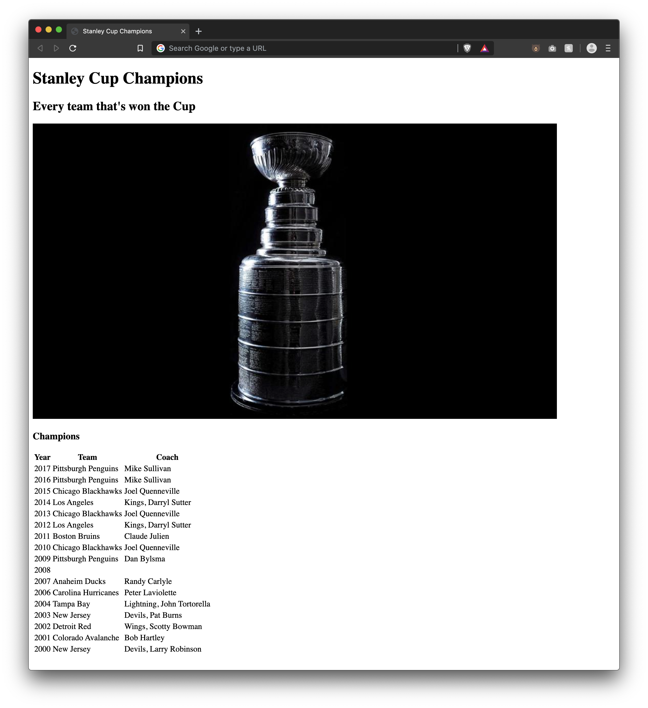

# Lesson 04 - HTML Tables

The `<table>` element represents tabular data — that is, information presented in a two-dimensional table comprised of rows and columns of cells containing data.

## Structuring Tables

There are a mix of tags that go along with making a table in html:

- `<table>` - the root level element
- `<thead>` - optional, signifies that the child elements are going to be headings for the table
- `<tbody>` - signifies that the child elements are going to be the contents for the table
- `<tr>` - indicates a row in the table (table row)
- `<td>` - indicates a cell in the table (table data)
- `<th>` - indicates a cell in the table that is a heading (table heading). To be used inside a `<thead>`

Take a look at the following example:

```html
<table>
  <thead>
    <tr>
      <th>Name</th>
      <th>Age</th>
    </tr>
  </thead>

  <tbody>
    <tr>
      <td>Bob</td>
      <td>25</td>
    </tr>

    <tr>
      <td>Joe</td>
      <td>33</td>
    </tr>
  </tbody>
</table>
```

Let's break the above down a bit.

We start off with the main `<table>` element. This contains all of the elements involved in building the table itself.

```diff
+ <table>
    ...
+ </table>
```

Then we have the table heading (`<thead>`) indicating that we are going to be defining the headers for the table inside.

```diff
<table>
+  <thead>
    <tr>
      <th>Name</th>
      <th>Age</th>
    </tr>
+  </thead>

  ...
</table>
```

Inside the `<thead>` we have a single `<tr>` to indicate that we need a row

```diff
<table>
  <thead>
+    <tr>
      <th>Name</th>
      <th>Age</th>
+    </tr>
  </thead>

  ...
</table>
```

Inside the `<tr>` we then specify two table headings `<th>`, `name` and `height`

```diff
<table>
  <thead>
    <tr>
+      <th>Name</th>
+      <th>Age</th>
    </tr>
  </thead>

  ...
</table>
```

Next to (not inside) the `<thead>` component, we have the `<tbody>` indicating that what is inside will have the tables contents.

```diff
<table>
  <thead>
    ...
  </thead>

+  <tbody>
    ...
+  </tbody>
</table>
```

Inside the `<tbody>` we have two `<tr>` elements, indicating that this table has two rows.

```diff
<table>
  ...

  <tbody>
+    <tr>
      <td>Bob</td>
      <td>25</td>
+    </tr>

+    <tr>
      <td>Joe</td>
      <td>33</td>
+    </tr>
  </tbody>
</table>
```

And inside each row, we have two `<td>` elements. The order of these elements is important as they must be in the same order as the table heading (if present).

```diff
<table>
  ...

  <tbody>
    <tr>
+      <td>Bob</td>
+      <td>25</td>
    </tr>

    <tr>
+      <td>Joe</td>
+      <td>33</td>
    </tr>
  </tbody>
</table>
```

This code would produce the following table

| Name | Age |
| ---- | --- |
| Bob  | 25  |
| Joe  | 33  |

## Empty Cells

Let's say we don't know Bob's name, only his age. We can't just exclude the `<td>` tag containing his name. We'd have to provide it an empty one so that it still gets formatted properly.

```html
<table>
  <thead>
    <tr>
      <th>Name</th>
      <th>Age</th>
    </tr>
  </thead>

  <tbody>
    <tr>
      <td></td>
      <!-- empty tag -->
      <td>25</td>
    </tr>

    <tr>
      <td>Joe</td>
      <td>33</td>
    </tr>
  </tbody>
</table>
```

This would produce

| Name | Age |
| ---- | --- |
|      | 25  |
| Joe  | 33  |

Vs if we just removed the tag, it would think that Bob's age is actually his name, due to the number of headings

```html
<table>
  <thead>
    <tr>
      <th>Name</th>
      <th>Age</th>
    </tr>
  </thead>

  <tbody>
    <tr>
      <!-- deleted tag -->
      <td>25</td>
    </tr>

    <tr>
      <td>Joe</td>
      <td>33</td>
    </tr>
  </tbody>
</table>
```

| Name | Age |
| ---- | --- |
| 25   |
| Joe  | 33  |

# Exercise Instructions

- Create a file `index.html`
- Add a document title: Stanley Cup Champions
- Add a main title: Stanley Cup Champions
- Add a subtitle: Every team that's won the Cup
- Add the following image: https://nhl.bamcontent.com/images/photos/287516894/1024x576/cut.jpg
- Add an `<h3>` title with the following text: Champions
- Create a table with the following headings: Year, Team, Coach
- Fill the table data with the following info

```
2017, Pittsburgh Penguins, Mike Sullivan
2016, Pittsburgh Penguins, Mike Sullivan
2015, Chicago Blackhawks, Joel Quenneville
2014, Los Angeles Kings, Darryl Sutter
2013, Chicago Blackhawks, Joel Quenneville
2012, Los Angeles Kings, Darryl Sutter
2011, Boston Bruins, Claude Julien
2010, Chicago Blackhawks, Joel Quenneville
2009, Pittsburgh Penguins, Dan Bylsma
2008, leave empty columns here for team and coach
2007, Anaheim Ducks, Randy Carlyle
2006, Carolina Hurricanes, Peter Laviolette
2004, Tampa Bay Lightning, John Tortorella
2003, New Jersey Devils, Pat Burns
2002, Detroit Red Wings, Scotty Bowman
2001, Colorado Avalanche, Bob Hartley
2000, New Jersey Devils, Larry Robinson
```

# Exercise Result



# Further Reading

- [MDN table doc](https://developer.mozilla.org/en-US/docs/Web/HTML/Element/table)
- [MDN thead doc](https://developer.mozilla.org/en-US/docs/Web/HTML/Element/thead)
- [MDN tbody doc](https://developer.mozilla.org/en-US/docs/Web/HTML/Element/tbody)
- [MDN tr doc](https://developer.mozilla.org/en-US/docs/Web/HTML/Element/tr)
- [MDN th doc](https://developer.mozilla.org/en-US/docs/Web/HTML/Element/th)
- [MDN td doc](https://developer.mozilla.org/en-US/docs/Web/HTML/Element/td)
