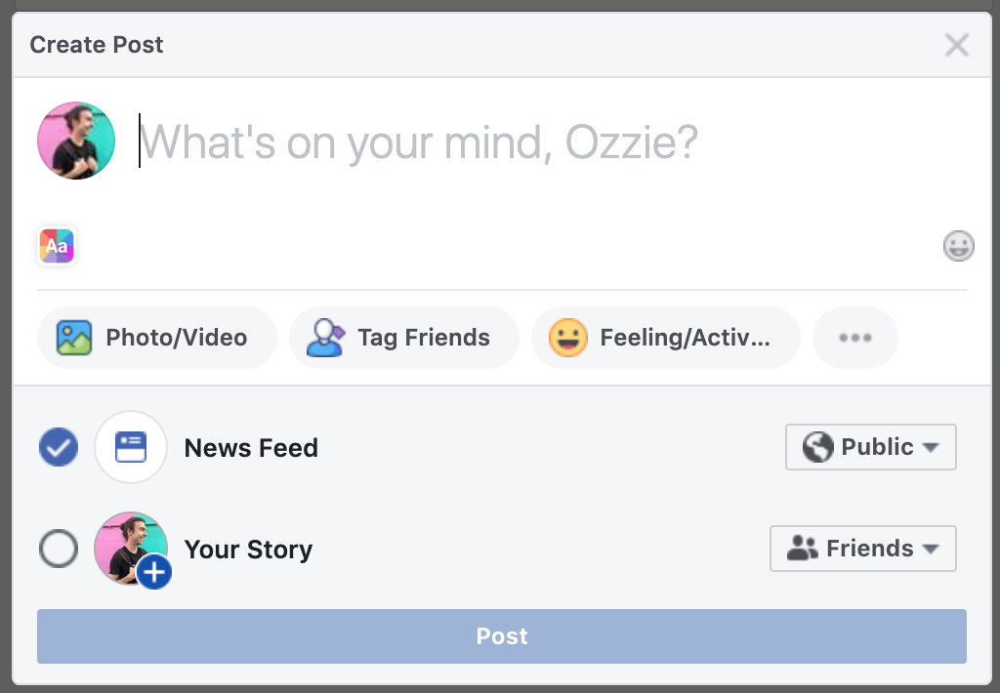
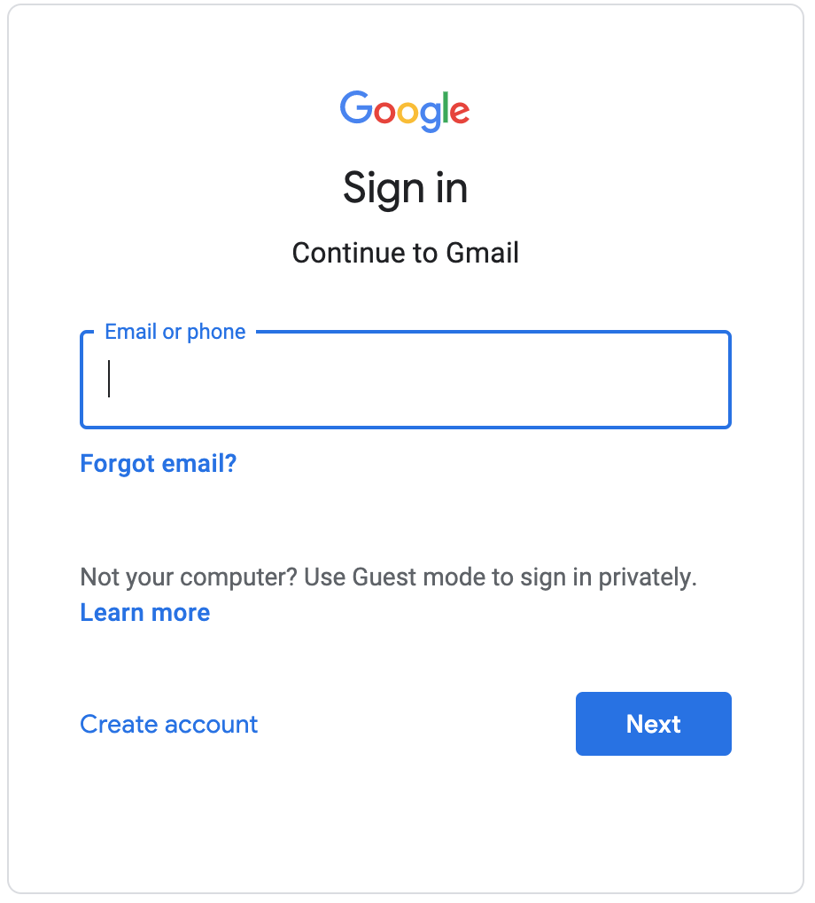
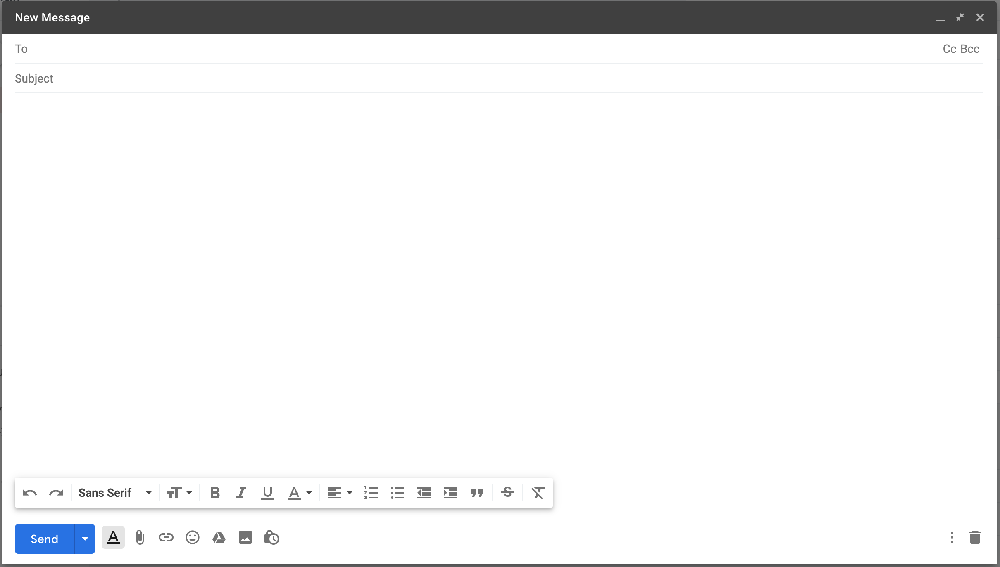
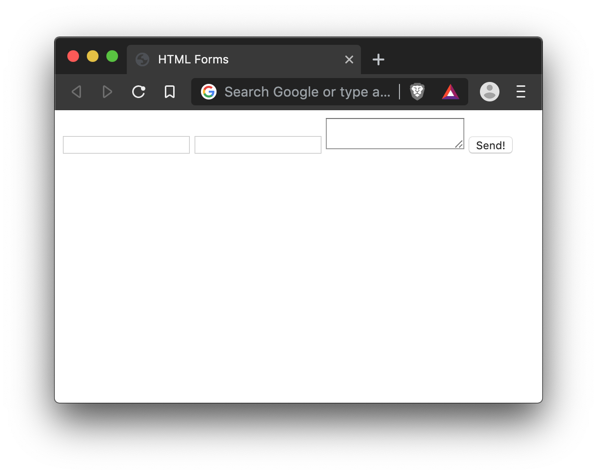

# Lesson 07 - HTML Forms

We're nearing the end! You've learned how to display text, images, group things together, make lists, and even link to other resources!

We've been pretty focused on displaying information to the user, but how would we _take in_ input from the user?

Introducing: Forms!






Above are some examples of forms across various popular services. Composing a tweet? You're using a form. Logging in? Yep it's a form. Composing an email? You guessed it. Form.

Let's see what a simple email composer would look like:

```html
<form action="send-email.php" method="post">
  <input type="email" name="email" />
  <input type="text" name="subject" />
  <textarea name="body"></textarea>
  <input type="submit" value="Send!" />
</form>
```

This produces the following form



It's pretty plain and hard to see what's going on. There's a few things we immidiately notice:

- Form inputs are displayed `inline`
- We can't tell what the inputs are for
- One `<input />` produces a button, not a text input

Let's go over what goes into HTML forms and see how we can improve this example

## `<form>`

`<form>` is the root container for HTML forms. A `<form>` element contains one or many input's as children. When the form is submitted it gathers all child inputs that contain a `name` attribute and sends it to the url specified in the form's `action` attribute.

### Attributes

- `action`
  - The uri of the server that will process the request
- `method`
  - The HTTP method that the browser uses to submit the form
  - Can be either `GET` or `POST`
- `enctype`
  - when the value of the method attribute is `POST`, enctype is the MIME type of content that is used to submit the form to the server. Possible values:
    - Default: `application/x-www-form-urlencoded`
    - To send file content: `multipart/form-data`
    - Just text: `text/plain`
  - If this attribute is omitted, `application/x-www-form-urlencoded` will be used

## `<input />`

The `<input />` tag is quite versatile. It could vary from a text input, to a button, to a color picker. What it does depends on the `type` attribute provided.

### Attributes

- `name`
  - When an input is sent to a server, it is sent in a `key: value` style format so that the server knows what text belongs to what input
  - The `name` attribute acts as the key in this case, and whatever is entered in the input is the value (or whatever the `value` attribute is set to)
- `disabled`
  - A Boolean attribute which is present if the input should be disabled
- `required`
  - Ensures the input to be non-empty before the form is submitted
- `value`
  - The inputs current value
- `placeholder`
  - Shows as a lighter text inside the input. Automatically disappears once text is entered
- `type`
  - Specifies what type of input should be accepted
  - If no `type` attribute is provided, `text` is used
  - Values can be (from [MDN](https://developer.mozilla.org/en-US/docs/Web/HTML/Element/input)):
    - `text` - A single-line text field. Line-breaks are automatically removed from the input value.
    - `button` - A push button with no default behavior.
    - `checkbox` - A check box allowing single values to be selected/deselected.
    - `color` - A control for specifying a color. A color picker's UI has no required features other than accepting simple colors as text.
    - `date` - A control for entering a date (year, month, and day, with no time).
    - `datetime` - A control for entering a date and time, with no time zone.
    - `email` - A field for editing an e-mail address.
    - `file` - A control that lets the user select a file. Use the accept attribute to define the types of files that the control can select.
    - `hidden` - A control that is not displayed but whose value is submitted to the server.
    - `image` - A graphical submit button. You must use the src attribute to define the source of the image and the alt attribute to define alternative text. You can use the height and width attributes to define the size of the image in pixels.
    - `month` - A control for entering a month and year, with no time zone.
    - `number` - A control for entering a number.
    - `password` - A single-line text field whose value is obscured. Use the maxlength and minlength attributes to specify the maximum length of the value that can be entered.
    - `radio` - A radio button, allowing a single value to be selected out of multiple choices.
    - `range` - A control for entering a number whose exact value is not important.
    - `reset` - A button that resets the contents of the form to default values.
    - `search` - A single-line text field for entering search strings. Line-breaks are automatically removed from the input value.
    - `submit` - A button that submits the form.
    - `tel` - A control for entering a telephone number.
    - `time` - A control for entering a time value with no time zone.
    - `url` - A field for entering a URL.
    - `week` - A control for entering a date consisting of a week-year number and a week number with no time zone.

### Common Input uses

#### Checkboxes

- The input elements of type checkbox are rendered by default as square boxes that are checked (ticked) when activated
- They allow you to select single values for submission in a form (or not).
- Radio buttons are similar to checkboxes, but with an important distinction:
  > radio buttons are grouped into a set in which only one radio button can be selected at a time, whereas checkboxes allow you to turn single values on and off. Where multiple controls exist, radio buttons allow one to be selected out of them all, whereas checkboxes allow multiple values to be selected.
- To select multiple values we need to use the same name input
- Use the value attribute to set each input selected value
- The checked attribute and value works the same way as radio buttons
- [MDN input type checkbox doc](https://developer.mozilla.org/en-US/docs/Web/HTML/Element/input/checkbox)

```html
<form>
  Select your favourite Harry Potter wizzards
  <input type="checkbox" name="wizards" value="harry potter" checked />
  Harry Potter
  <input type="checkbox" name="wizards" value="hermione granger" checked />
  Hermione Granger
  <input type="checkbox" name="wizards" value="ron weasley" />
  Ron Weasley
  <input type="checkbox" name="wizards" value="aberforth dumbledore" />
  Aberforth Dumbledore
</form>
```

#### Radio Buttons

- The input type radio elements are generally used in radio groups—collections of radio buttons describing a set of related options
- Only one radio button in a given group can be selected at the same time
- Radio buttons are typically rendered as small circles, which are filled or highlighted when selected
- To define a radio group each of the radio buttons in the group must have same name attribute
- The user will see a legend next to each radio button by using a label element or just plain text
- [MDN input type radio doc](https://developer.mozilla.org/en-US/docs/Web/HTML/Element/input/radio)

```html
<form>
  Are you a Jets Fan?
  <input type="radio" name="jetsfan" value="true" /> Oh Yeahhhhhh, Go Jets!!!
  <input type="radio" name="jetsfan" value="false" /> No
</form>
```

#### Submit Button

- The input type submit is just a button that submits the form
- This type of element's value attribute contains the button's label
- If you don't specify a value, the button will have a default label, chosen by the user agent
- [MDN input submit doc](https://developer.mozilla.org/en-US/docs/Web/HTML/Element/input/submit)

```html
<form>
  <input type="submit" value="Submit this form" />
</form>
```

## `<textarea>`

The textarea element represents a multi-line plain-text editing control. This element has an opening and close tag. Unlike the `<input />` element, `<textarea>` has it's value set based on what's inside its openining and closing tags.

```html
<textarea name="body">This would be what is inside the textarea</textarea>
```

# Exercise Instructions

# Exercise Result

# Further Reading
